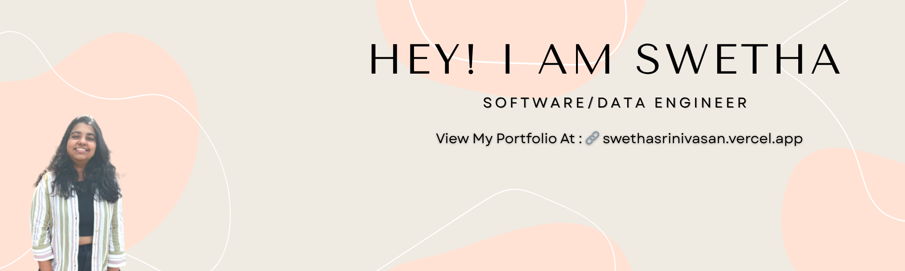

  

<h1 align="center">Hi, I'm Swetha Srinivasan 👋</h1>

  Software/Data Engineer • Cloud & AI Enthusiast • RIT Grad Student  

---

🎓 Master’s Student – Information Technology & Analytics @ RIT  
💻 Building cool stuff with Python, AWS, SQL, and Terraform  
🧠 Exploring AI, Blockchain Analytics & Data Engineering  
📍 Based out of New York, USA  
🌐 [Portfolio](https://swethasrinivasan.vercel.app)  
📫 ss9577@rit.edu  
🔗 [LinkedIn](https://www.linkedin.com/in/swethasrinivasan25/)

---

### ⚒️ Projects I’m Proud Of

- **StudyMate** – AI-powered study assistant to fight decision fatigue  
- **BrevityCloud** – Chrome extension that summarizes and answers questions from live websites  

---

### 🌱 Current Goals

- Crack 500+ LeetCode problems  
- Become a certified Data/Cloud Engineer (Databricks, AWS)  
- Land a full-time role in Backend, Data, or Cloud/Infra Engineering  
